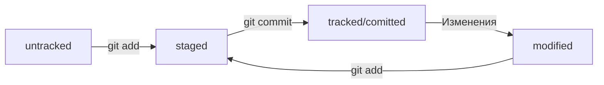

# Описание программы

Этот проект выступает небольшой шпоргалкой по работе с GIT. Написана она в рамках обучения на платформе практикума яндекс.

## Настройка Git на ОС Windows

Скачать можно по ссылке.
https://git-scm.com/downloads/win

После правильной установки команда 'git version' должна вернуть текущую версию.

    '''bash
    $ git version
    git version 2.46.2.windows.1
    '''

Для начальной настройки достаточно указать имя и почту для работы с Git.

    '''bash
    git config --global user.email "you@example.com"
    git config --global user.name "Your Name"
    '''

Для того, чтобы посмотреть текущие настройки достаточно ввести одну из команд.

    '''bash
    $ git version 
    $ git config --list 
    '''

## Cоздание локального репозитория 

В папке будущего проекта нужно вызвать команду.

    '''bash
    $ git init
    '''

Это создаст папку, где Git будет хранить всю историю изменений локального проекта. Чтобы удалить историю и "расгитить" проект достаточно удалить эту папку. Она лежит в папке с проектом и имеет имя ".git".

Теперь можно работать с этим проектом. Первое что понадобится почти в любой ситуации - узнать статус репозитория.

    '''bash
    $ git status 
    '''

Каждый раз, когда появляются новые или меняются старые файлы нужно их пометить для сохранения. Для этого используется команда 'git add'. 

    '''bash
    $ git add --all 
    $ git add todo.txt
    $ git add .
    '''

Команда 'git add' не сохраняет содержимое файлов в репозитории. Само сохранение, или фиксацию состояния файлов, называют коммитом (от англ. commit — «совершать», «фиксировать»). «Сделать коммит» значит сохранить текущую версию файла.
Если провести аналогию, команду git add можно сравнить с добавлением товаров в корзину в интернет-магазине, а коммит — с оформлением и оплатой заказа.

    '''bash
    $ git commit -m 'Мой первый коммит!' 
    '''

Ключ -m позволяет добавить комментарий к коммиту. Обычно пишут что изменилось с предыдущего коммита. Коммит - Сохраненный срез изменений в программе.
Посмотреть все коммиты по проекту можно сделать следующей командой.

    '''bash
    $ git log
    '''

## Сохранение репозитория в GitHub

Проекты можно хранить на специальном ресурсе GitHub. Но прежде чем начать работать с удаленным сервисом нужно озаботится наличием шифрования.
Создать пару SSH ключей можно не закрывая консоль.

    '''bash
    $ ssh-keygen -t ed25519 -C "электронная почта, к которой привязан ваш аккаунт на GitHub"
    $ ssh-keygen -t rsa -b 4096 -C "электронная почта, к которой привязан ваш аккаунт на GitHub"
    '''
Обе команды генерируют пару ключей, но используют разные алгоритмы шифрования. Если не работает один, то попробовать можно второй. Хранятся созданные ключи в домашней папке пользователя. Этой командой можно посмотреть созданные пары ключей.

    '''bash
    $ ls -a ~/.ssh
    '''

Публичный ключ нужно сохранить в настройках GitHub. Для этого скопируйте содержимое файла в этой папке с окончанием .pub
Скопировать можно на пример так:

    '''bash
    clip < ~/.ssh/id_ed25519.pub
    '''
    
проверить подключение и правильность настроек можно командой:

    '''bash
    $ ssh -T git@github.com
    '''

Для подтверждения подлинности сервер генерирует и публикует ключи SHA256. Вы можете проверить ключи GitHub. Если ключ в предупреждении совпадает с тем, что вы видите на сайте, значит, сервер является действительным. Введите yes, чтобы продолжить. Вы увидите приветствие на экране. После можно опубликовать новый репозиторий на сайте гитхаба и присоеденить папку текущего проекта к нему. Для этого создаем новый репозиторий пишем имя и копируем ссылку для SSH соединения.

    '''bash
    $ git remote add origin git@github.com:%ИМЯ_АККАУНТА%/%ИМЯ_ПРОЕКТА%.git
    '''

Команде необходимо передать два параметра: имя удалённого репозитория и его URL. В качестве имени используйте слово origin. А URL вы скопировали со страницы удалённого репозитория.
origin (англ. «источник») — стандартный псевдоним, с помощью которого можно обращаться к главному удалённому репозиторию (обычно такой репозиторий один). Это значительно упрощает работу.
Убедиться, что репозитории связаны:

    '''bash
    $ git remote -v
    '''
    
Ну и выгружаем проект на хаб:

    '''bash
    $ git push -u origin main
    '''
    
Если команда приведёт к ошибке, попробуйте заменить 'main' на 'master'.
В дальнейшем при работе с удалённым репозиторием флаг -u можно опустить и писать просто 'git push'.

## Статусы

* untracked (англ. «неотслеживаемый»)

Новые файлы в Git-репозитории помечаются как untracked, то есть неотслеживаемые. Git «видит», что такой файл существует, 
но не следит за изменениями в нём. У untracked-файла нет предыдущих версий, зафиксированных в коммитах или через команду 
git add.

* staged (англ. «подготовленный»)

После выполнения команды git add файл попадает в staging area (от англ. stage — «сцена», «этап [процесса]» и area — 
«область»), то есть в список файлов, которые войдут в коммит. В этот момент файл находится в состоянии staged.

* tracked — это противоположность untracked. Оно довольно широкое по смыслу: в него попадают файлы, которые уже были зафиксированы с помощью git commit, а также файлы, которые были добавлены в staging area командой git add. То есть все файлы, в которых Git так или иначе отслеживает изменения.

* modified (англ. «изменённый»)

## Хеш — идентификатор коммита

Хеширование (от англ. hash, «рубить», «крошить», «мешанина») — это способ преобразовать набор данных и получить их «отпечаток»

Git хранит таблицу соответствий хеш → информация о коммите. Если вы знаете хеш, вы можете узнать всё остальное: автора и дату коммита и содержимое закоммиченных файлов. Можно сказать, что хеш — основной идентификатор коммита.

## Логи git

После вызова `git log` появляется список коммитов с их описанием.

Элементы описания:
1. Строка из цифр и латинских букв после слова commit — это уже знакомый вам хеш коммита.
2. Author — имя автора и его электронная почта.
3. Date — дата и время создания коммита.
4. Сообщение к коммиту.

Если в репозитории уже много коммитов — например, сотни или тысячи, — пригодится сокращённый лог. С ним можно быстро найти нужный коммит по описанию.

Сокращённый лог вызывают командой `git log --oneline` (англ. «одной строкой»). При этом в терминале появятся только первые несколько символов хеша каждого коммита и комментарии к ним.

## HEAD

При вызове команды `git log` вы также могли заметить надпись (HEAD -> master) после хеша одного из коммитов.

Файл HEAD (англ. «голова», «головной») — один из служебных файлов папки .git. Он указывает на коммит, который сделан последним (то есть на самый новый).

Внутри HEAD — ссылка на служебный файл: refs/heads/master (или refs/heads/main в зависимости от названия ветки). Если заглянуть в этот файл, можно увидеть хеш последнего коммита.

Когда вы делаете коммит, Git обновляет refs/heads/master — записывает в него хеш последнего коммита. Получается, что HEAD тоже обновляется, так как ссылается на refs/heads/master.

При работе с Git указатель HEAD используется довольно часто. Мы уже упоминали, что многие команды Git принимают в качестве параметра хеш коммита. Если нужно передать последний коммит, то вместо его хеша можно просто написать слово HEAD — Git поймёт, что вы имели в виду последний коммит.

